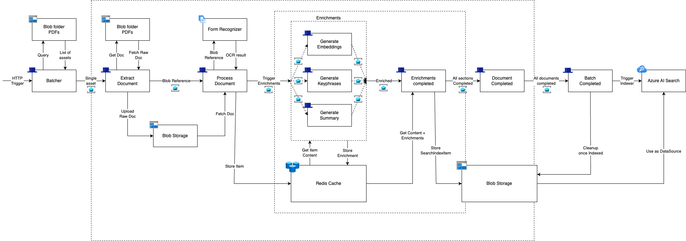

# search-ingest-dapr

End-to-end search ingestion pipeline that takes PDF documents from a folder in blob, uses form recognizer, creates embeddings & enrichments and ultimately adds these documents to an azure search index.

## Overview

<!-- img of dapr-overview.png -->


## Deploy resources

To deploy all resources, copy `sample.env` to `.env` and update the values. Then run  `./deploy.sh`.

> Before you start, upload some PDFs in your blob storage with the specified `source_folder_path` e.g. in `/content/PDFs/` when using the path above

## Running the project locally

The easiest way to run the project is to load it in Visual Studio Code using the Dev Containers extension as this automatically sets up the environment for you.

Once open as a dev container:
1. Run `dapr init` to initialize Dapr
2. Run `dapr run -f ./dapr.yaml` to start the services
3. Invoke an HTTP trigger to the `batcher` using: 
   
```bash
curl -X POST http://127.0.0.1:6000/batcher-trigger \
     -H "Content-Type: application/json" \
     -d '{"source_folder_path": "PDFs/", "destination_folder_path": "uploadedPDFs/", "searchitems_folder_path": "searchIndexItems/", "searchindexer_name": "daprdemotest"}'
```

With the following ingestion parameters:
- `source_folder_path` - the folder in above container to source PDFs from 
- `destination_folder_path` - the destination folder where source PDFs are temporarily stored for ingestion
- `searchitems_folder_path` - the path in above container where SearchIndexItems are stored, as configured in your Azure AI Search DataSource
- `searchindexer_name` - the name of the search indexer to use. This will be created if it doesn't exist yet

> To access the batcher in the kubernetes cluster, port-forward port 6000 using: `kubectl port-forward batcher-podid 6000:6000`

## Cleaning up Dapr logs

When running, logs for each service are written to a `.dapr` folder under each service folder.
These can be cleaned up by running `find . -name ".dapr" | xargs rm -rf` from the root of the project.

